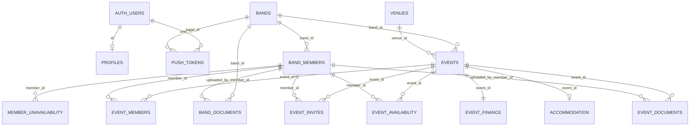

# GigSynq Database Architecture (Supabase)

Source: `supabase/migrations/20260513094420_remote_schema.sql`

Scope notes:
- Backup tables prefixed with `_backup_` are intentionally excluded.
- This document reflects only objects present in the migration.

## Core Tables And Purpose

- `bands`: Tenant root entity for each band (`band_id`, `band_name`, status, logo).
- `band_members`: Membership, identity mapping (`auth_user_id`), role/permission flags, and per-member capabilities.
- `profiles`: Per-auth-user profile row (FK to `auth.users`), plus profile-level defaults.
- `events`: Main event record (date/type/status, schedule, contacts, notes, links, finance-related fields, `band_id`, `venue_id`).
- `event_members`: Explicit event lineup assignment (many-to-many between events and band members).
- `event_invites`: Invite/response state per event/member (`status`, `responded_at`, `set_by_system`).
- `event_availability`: Availability state per event/member using enum `availability_status` plus legacy text mirror.
- `event_finance`: Finance breakdown per event (1:1 with `events` by `event_id`).
- `venues`: Venue master data (name/location/contact/capacity).
- `accommodation`: Accommodation plan per event (unique `event_id`).
- `member_unavailability`: Date ranges where a member is unavailable.
- `band_documents`: Band-scoped document metadata with storage bucket/path.
- `event_documents`: Event-scoped document metadata with storage bucket/path.
- `push_tokens`: Device push tokens by user and band.
- `app_settings`: Global app defaults/settings row (`id` defaults to `global`).

## Key Relationships

- Tenancy model: `bands` -> `band_members` and `bands` -> `events`.
- Event model: `events` is central; related to lineup (`event_members`), invites (`event_invites`), availability (`event_availability`), finance (`event_finance`), accommodation (`accommodation`), docs (`event_documents`), and venue (`venues`).
- Identity model: app users (`auth.users`) map to `profiles.id` and optionally `band_members.auth_user_id`.
- Notification model: `push_tokens` ties `auth.users` + `bands` to Expo push tokens.

## Foreign Key Relationships

- `accommodation.event_id` -> `events.event_id` (ON DELETE CASCADE)
- `band_documents.band_id` -> `bands.band_id` (ON DELETE CASCADE)
- `band_documents.uploaded_by_member_id` -> `band_members.member_id` (ON DELETE SET NULL)
- `band_members.band_id` -> `bands.band_id` (ON DELETE SET NULL)
- `event_availability.event_id` -> `events.event_id` (ON DELETE CASCADE)
- `event_availability.member_id` -> `band_members.member_id` (ON DELETE CASCADE)
- `event_documents.event_id` -> `events.event_id` (ON DELETE CASCADE)
- `event_documents.uploaded_by_member_id` -> `band_members.member_id` (ON DELETE SET NULL)
- `event_finance.event_id` -> `events.event_id` (ON DELETE CASCADE)
- `event_invites.event_id` -> `events.event_id` (ON DELETE CASCADE)
- `event_invites.member_id` -> `band_members.member_id` (ON DELETE CASCADE)
- `event_members.event_id` -> `events.event_id` (ON DELETE CASCADE)
- `event_members.member_id` -> `band_members.member_id` (ON DELETE CASCADE)
- `events.band_id` -> `bands.band_id` (ON DELETE SET NULL)
- `events.venue_id` -> `venues.venue_id` (ON UPDATE CASCADE, ON DELETE RESTRICT)
- `member_unavailability.member_id` -> `band_members.member_id` (ON DELETE CASCADE)
- `profiles.id` -> `auth.users.id` (ON DELETE CASCADE)
- `push_tokens.band_id` -> `bands.band_id` (ON DELETE CASCADE)
- `push_tokens.user_id` -> `auth.users.id` (ON DELETE CASCADE)

## RLS-Sensitive Tables

RLS is enabled on:
- `accommodation`
- `app_settings`
- `band_documents`
- `band_members`
- `bands`
- `event_availability`
- `event_documents`
- `event_finance`
- `event_invites`
- `event_members`
- `events`
- `member_unavailability`
- `profiles`
- `push_tokens`
- `venues`

Policy patterns in this migration:
- Band membership/admin checks via `band_members`.
- Tenant scoping via `current_band_id()`.
- Document access separated for band-level vs event-level docs.
- `push_tokens` is self-service (`user_id = auth.uid()`).
- `app_settings` currently permissive (`anon`/`authenticated` read/write policies exist).

## Triggers

- `trg_set_event_band_id` on `events` -> `set_event_band_id()` (BEFORE INSERT)
- `trg_events_create_invites` on `events` -> `create_event_invites_for_band()` (AFTER INSERT)
- `trg_seed_event_availability` on `events` -> `seed_event_availability()` (AFTER INSERT)
- `trg_seed_event_availability_core_band` on `events` -> `seed_event_availability_core_band()` (AFTER INSERT)
- `trg_create_availability_for_new_member` on `band_members` -> `create_availability_for_new_member()` (AFTER INSERT)
- `trg_invites_seed_availability` on `event_invites` -> `seed_availability_on_invite()` (AFTER INSERT)
- `trg_sync_event_availability_status_text` on `event_availability` -> `sync_event_availability_status_text()` (BEFORE INSERT/UPDATE OF `status`)
- `trg_accommodation_updated_at` on `accommodation` -> `set_updated_at()` (BEFORE UPDATE)
- `trg_app_settings_updated_at` on `app_settings` -> `set_updated_at()` (BEFORE UPDATE)
- `trg_event_availability_updated_at` on `event_availability` -> `set_updated_at()` (BEFORE UPDATE)
- `trg_event_finance_updated_at` on `event_finance` -> `set_updated_at()` (BEFORE UPDATE)
- `trg_event_invites_updated_at` on `event_invites` -> `set_updated_at()` (BEFORE UPDATE)

## Functions

### SECURITY DEFINER (highlighted)

- `can_read_event(p_event_id uuid, p_band_id uuid)`
- `can_update_event_availability(target_member_id uuid)`
- `create_event_invites_for_band()`
- `current_band_id()`
- `handle_new_user()`

### Other Functions

- `create_availability_for_new_member()`
- `event_has_custom_lineup(p_event_id uuid)`
- `is_band_admin(_band_id uuid)`
- `is_band_member(_band_id uuid)`
- `search_venues(search_text text)`
- `seed_availability_on_invite()`
- `seed_event_availability()`
- `seed_event_availability_core_band()`
- `set_event_band_id()`
- `set_invite_status(p_event_id uuid, p_member_id uuid, p_status text)`
- `set_updated_at()`
- `sync_event_availability_status_text()`

## Storage Buckets And Storage-Related Constraints

Explicit bucket metadata appears in application tables:
- `band_documents.storage_bucket` default: `band-docs`
- `event_documents.storage_bucket` default: `event-docs`

Path constraints:
- `band_documents.storage_path` must match `bands/{band_id}/...`
- `event_documents.storage_path` must match `events/{event_id}/...`

Storage policies:
- `band-logos`: public read; authenticated upload/update/delete.
- `band-docs`: band members can read/upload within their band folder; admins can delete.
- `event-docs`: band members can read event docs; admins with admin mode enabled can upload/delete event docs.
- Metadata access is also controlled through `band_documents` and `event_documents` RLS.

## Edge-Function-Related Tables

No explicit edge-function queue/audit table is defined.
Most likely integration points present in schema:
- `push_tokens` for notification delivery targets.
- `band_documents` and `event_documents` for signed-URL or file operations against Supabase Storage.

## Push Notification Flow (Schema-Level)

- Device registers token into `push_tokens` (`expo_push_token`, `platform`, `device_name`, `is_active`).
- RLS allows users to manage only their own token rows (`user_id = auth.uid()`).
- Tokens are band-scoped (`band_id`) and user-scoped (`user_id`), enabling tenant-targeted notification fan-out.
- Migration does not define a notification outbox/history table; delivery orchestration is external to this schema.

## i18n/Multilingual-Critical Tables (Future)

Tables with high concentration of user-facing text and labels:
- `events` (event types/status, notes, contacts, URLs, schedule/finance notes)
- `venues` (name/address/city/contact/notes/capacity notes)
- `band_members` (display name, role/position labels, free-text custom role/positions)
- `band_documents` and `event_documents` (titles, `doc_type`)
- `event_invites` and `event_availability` (status labels and notes)
- `member_unavailability` (`reason`)
- `accommodation` (name/address/notes/reference fields)
- `app_settings` and `profiles` (default departure address/postcode text)

These tables are likely critical because they store presentation-facing text, categorical labels, and free-text content.

## Core ER Diagram (Mermaid)

